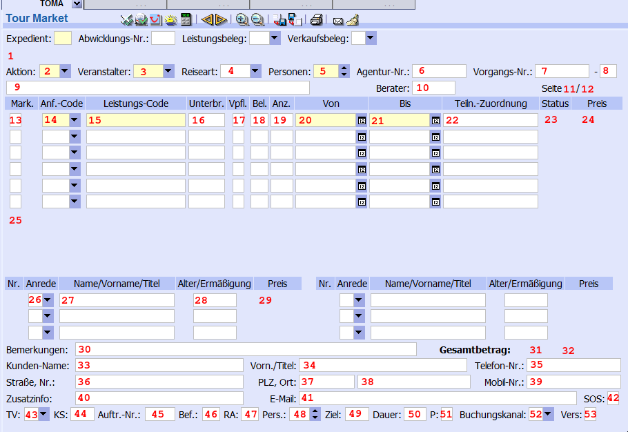

# UBP CRS Adapter

This project provides a JS module to enable an web-application to communicate with a CRS (TOMA, SABRE, CETS).


## Interface

After loading the script into your application
```
<script type="text/application" src="[path/to/script.js]"></script>
```

you are able to connect to a CRS via:
```
ubpCrsAdapter.connect(crsType);
```

When you are connected you can get the data from the CRS via:
```
var crsData = ubpCrsAdapter.getData();
```

or set data to the CRS via:
```
ubpCrsAdapter.setData(crsData);
```

And also you can close the opened frame in the CRS:
```
ubpCrsAdapter.exit()
```


### Supported CRS types

Currently this module supports the connection to following CRS:

| CRS  | type |
| :--- | :--- |
| TOMA | toma | 


### CRS data structure

Following data model is used for the communication with every CRS:

```
{
    errorLine,
    action,
    operator,
    travelType,
    numTravellers,
    agencyNumber,
    bookingNumber1,
    bookingNumber2,
    multiFunctionLine,
    consultantNumber,
    remark,
 
    services[0-5]
        .marker,
        .serviceType,
        .serviceCode,
        .accommodation,
        .boardAndLodging,
        .occupancy,
        .quantity,
        .fromDate,
        .toDate,
        .travellerAssociation,
        .status,
        .price,
 
    messages[0-3],
 
    travellers[0-5]
        .title,
        .name,
        .discount,
        .pricePerPassenger,
    
    customer
        .lastName,
        .firstName,
        .streetAndNumber,
        .postalCode,
        .city,
        .phone,
        .mobilePhone,
        .email,
        .additionalInfo,
    
    marketing
        .transferToTV,
        .costCenter,
        .orderNumber,
        .transport,
        .travelType,
        .numPassengers,
        .destination,
        .duration,
        .storeData,
        .bookingChannel,
        .insurancePolicy,
 
    // "markedServices" is a list of services where the marker property is set to "X"
    // the structure is the same like "services"
    markedServices[0].*
}
```


## Adapter model mapping to CRS mask

### Amadeus TOMA 



|   #  | property                    |   #  | property                         |   #  | property |
| :--- | :---                        | :--- | :---                             | :--- | :---     |
|   1  | errorLine                   |  21  | services[0].toDate               |  41* | customer.email |
|   2  | action                      |  22  | services[0].travellerAssociation |  42  | n.a. | 
|   3  | operator                    |  23  | services[0].status               |  43  | marketing.transferToTV | 
|   4  | travelType                  |  24  | services[0].price                |  44  | marketing.costCenter | 
|   5  | numTravellers               |  25  | messages[0]                      |  45  | marketing.orderNumber |   
|   6  | agencyNumber                |  26  | travellers[0].title              |  46  | marketing.transport |   
|   7  | bookingNumber1              |  27  | travellers[0].name               |  47  | marketing.travelType | 
|   8  | bookingNumber2              |  28  | travellers[0].discount           |  48  | marketing.numPassenger | 
|   9  | multiFunctionLine           |  29  | travellers[0].pricePerPassenger  |  49  | marketing.destination | 
|  10  | consultantNumber            |  30  | remark                           |  50  | marketing.duration | 
|  11  | n.a.                        |  31  | n.a.                             |  51  | marketing.storeData |
|  12  | n.a.                        |  32  | n.a.                             |  52  | marketing.bookingChannel | 
|  13  | services[0].marker          |  33  | customer.lastName                |  53  | marketing.insurancePolicy | 
|  14  | services[0].serviceType     |  34  | customer.firstName               |
|  15  | services[0].serviceCode     |  35  | customer.phone                   |
|  16  | services[0].accommodation   |  36  | customer.streetAndNumber         |
|  17  | services[0].boardAndLodging |  37  | customer.postalCode              |
|  18  | services[0].occupancy       |  38  | customer.city                    |
|  19  | services[0].quantity        |  39* | customer.mobilePhone             |
|  20  | services[0].fromDate        |  40  | customer.additionalInfo          |

`*` these properties are readonly 

There are up to 6 (index 0-5) services possible.

There are up to 4 (index 0-3) messages possible.

There are up to 6 (index 0-5) travellers possible.
