### Test Examples

Here you can see how the data will look like in the CRS after a transfer.

#### type `'car'`

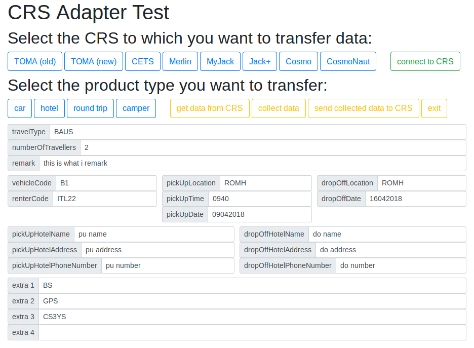

##### Toma

##### Toma2

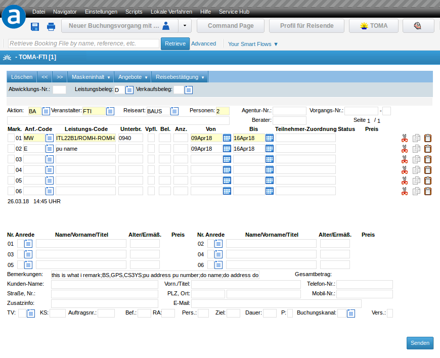

##### Merlin

##### Bewotec

##### CETS

#### type `'hotel'`

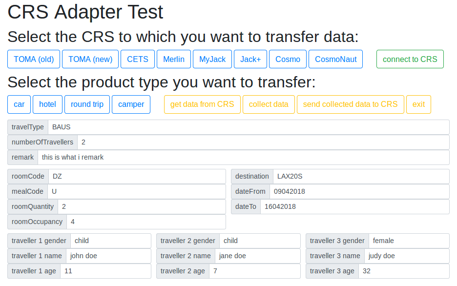

##### Toma

##### Toma2

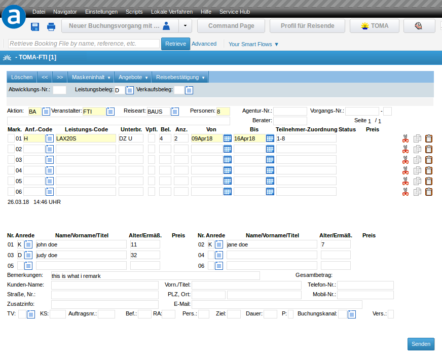

##### Merlin

##### Bewotec

#### type `'roundtrip'`

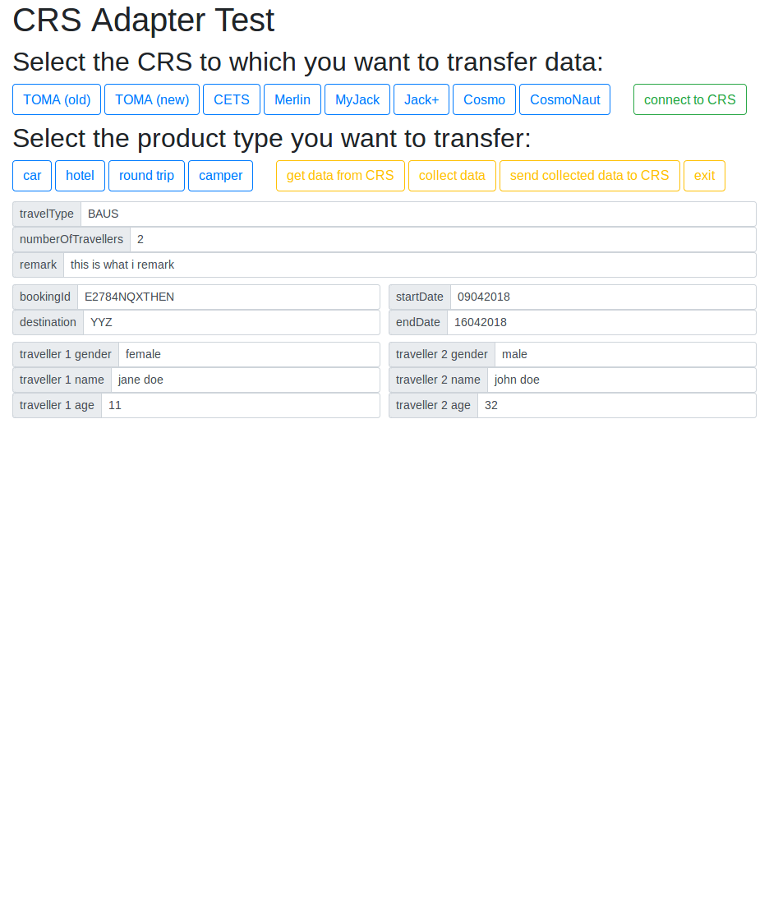

##### Toma

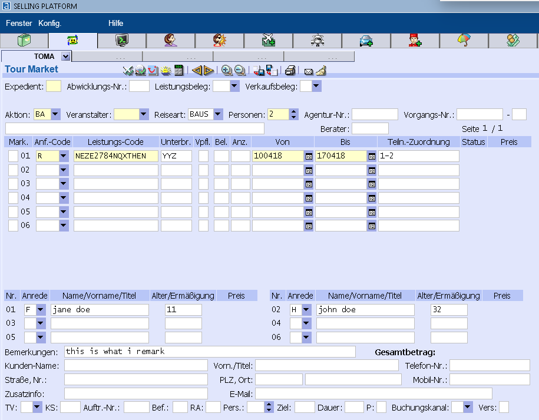

##### Toma2

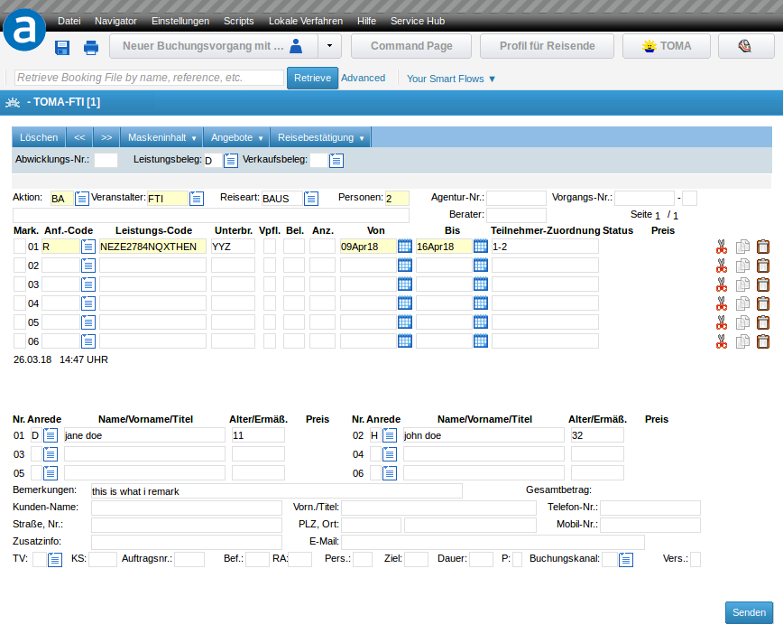

##### Merlin

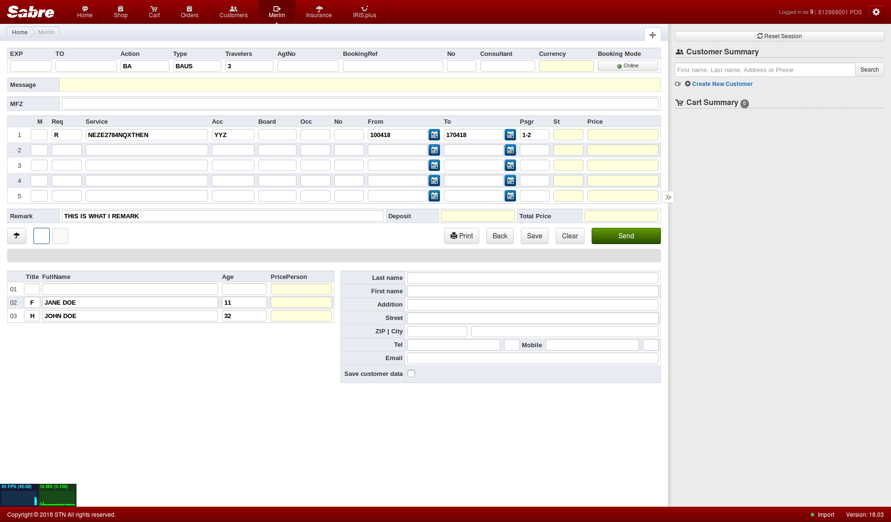

##### Bewotec

##### CETS

#### type `'camper'`

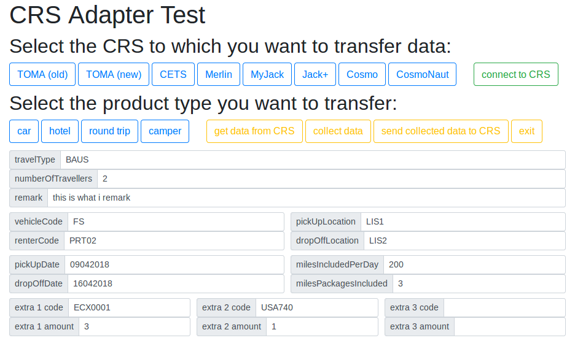

##### Toma

##### Toma2

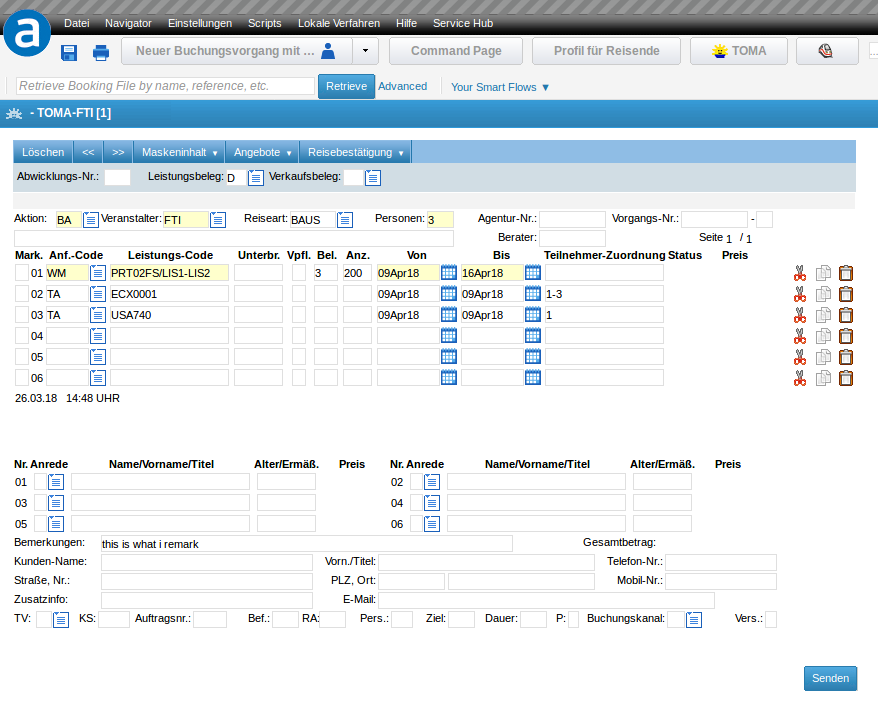

##### Merlin

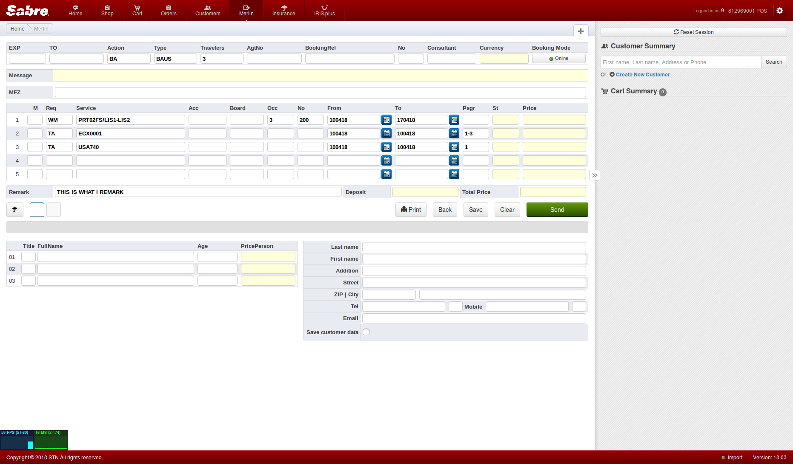

##### Bewotec

